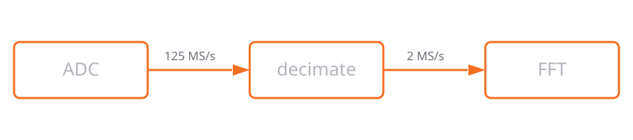
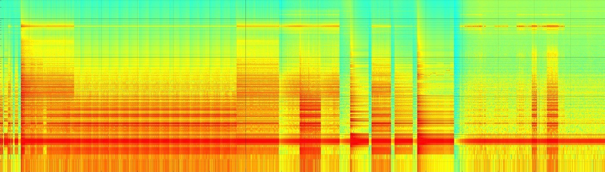
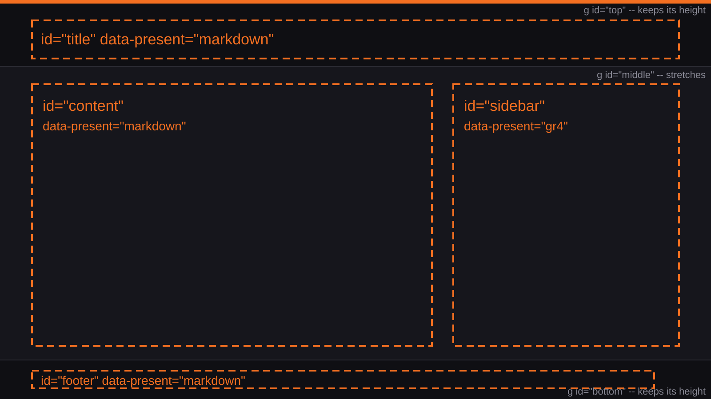
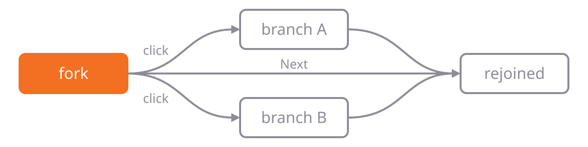
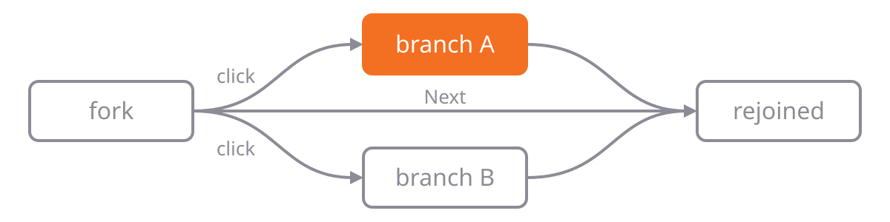
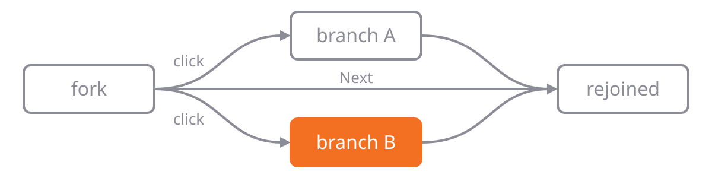
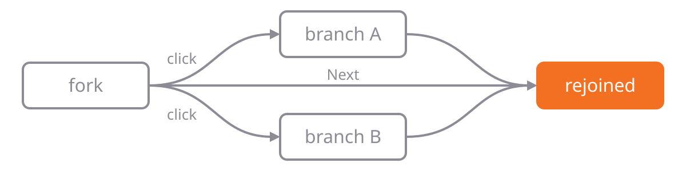
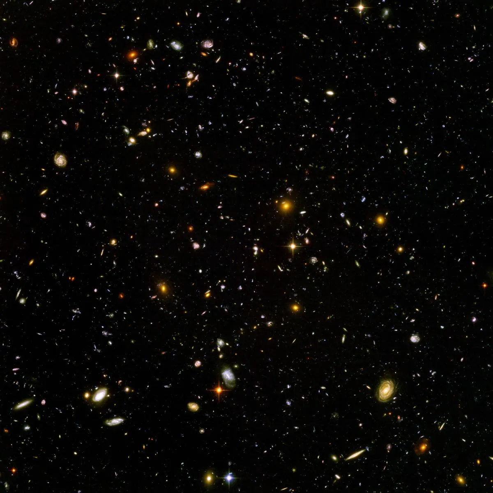
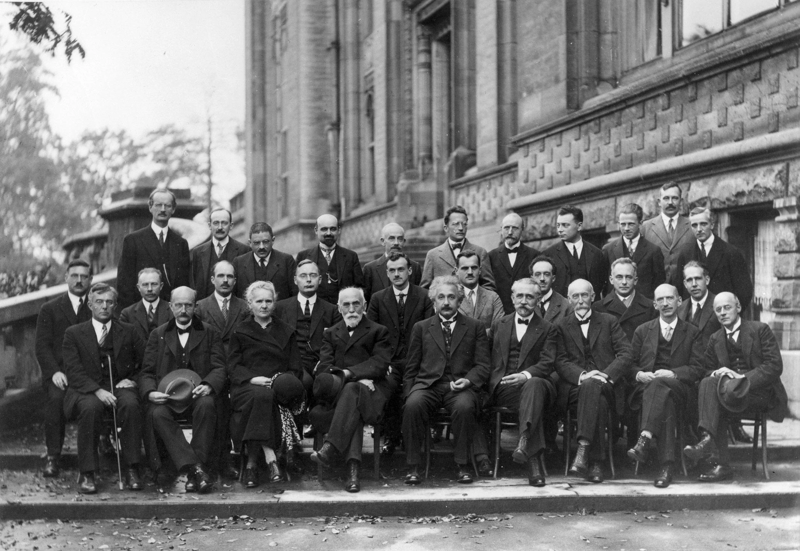

# gr4-present<br>Markdown and SVG Slides with live GNU Radio 4 Signals {#intro}

Slides written in Markdown, laid out by SVG masters, with **GNU Radio 4** and OpenDigitizer widgets running live
inside them, natively and in the browser.





:::notes
Press right arrow, space or page down to advance, left arrow to go back, Home to return here. The address bar
follows the cursor, so any view can be linked or reloaded.

This deck is also the viewer's test suite: every slide demonstrates one feature and is covered by a test, so a
rendering regression shows up here first.
:::

# Text, Lists, References, and Speaker Notes<br>real bold, italic and monospace Faces {#markdown}

:::layout
grid: [(syntax, 0.45), (content)]
:::

:::syntax
```markdown
Body text, **strong**, *emphasis*
and `inline code`.

- unordered items, nested:
  - windowing[^harris]
- and ordered ones:

1. acquire
2. transform[^cooley]
3. display

[^harris]: F. J. Harris, "On the use of ...
[^cooley]: J. W. Cooley and ...

:::notes
For the presenter only: N shows them.
:::
```
:::

Body text, **strong**, *emphasis* and `inline code`.

- unordered items, nested:
  - windowing reduces spectral leakage[^harris]
- and ordered ones:

1. acquire
2. transform[^cooley]
3. display

A `:::notes` block belongs to the presenter: **N** shows it at the foot of the screen, **S** opens a presenter
window with the notes, the elapsed time and the clock.

[^harris]: F. J. Harris, "On the use of windows for harmonic analysis with the discrete Fourier transform," *Proc. IEEE*, vol. 66, no. 1, pp. 51-83, 1978.

[^cooley]: J. W. Cooley and J. W. Tukey, "An algorithm for the machine calculation of complex Fourier series," *Math. Comput.*, vol. 19, no. 90, pp. 297-301, 1965.

:::notes
This is what the panel shows: this view's notes, how far through the deck you are, and which view comes next. The
slide above does not move, so the room sees nothing change. The presenter window builds no live graphs of its own,
and the two windows follow each other, whichever one a key is pressed in.

Body text is Liberation Sans, with real bold, italic and bold-italic faces, never synthesised; code is Liberation
Mono. Both cover Latin, Greek and Cyrillic, so σ, μ, Ω, ∑, π and ≈ read the same in prose and in code.
:::

# Source Code Highlighting<br>per Language, long Lines wrap with a hanging Indent {#code}

:::layout
grid: [(code_cpp), (code_python), (code_yaml)]
:::

:::code_cpp {size=85%}
```cpp
#include <cmath>
#include <span>
#include <vector>

namespace gr::present {
constexpr float kNyquist = 0.5f;

struct Sweep {
    double start = 1e3; // Hz
    double stop  = 1e6;
    int    steps = 10;
};

/// a log sweep, `steps` per decade
auto frequencies(const Sweep& s) {
    std::vector<double> points;
    const double ratio =
        std::pow(10.0, 1.0 / s.steps);
    for (double f = s.start; f <= s.stop;
         f *= ratio) {
        points.push_back(f);
    }
    return points;
}
} // namespace gr::present
```
:::

:::code_python {size=85%}
```python
from dataclasses import dataclass
import math

@dataclass
class Sweep:
    start: float = 1e3   # Hz
    stop: float = 1e6
    steps: int = 10      # per decade

    def frequencies(self):
        """a log sweep, per decade"""
        ratio = 10 ** (1 / self.steps)
        f = self.start
        while f <= self.stop:
            yield f
            f *= ratio

    def decades(self) -> float:
        return math.log10(
            self.stop / self.start)

print(list(Sweep(steps=2)
           .frequencies()))
```
:::

:::code_yaml {size=85%}
```yaml
presentation:
  title: gr4-present
  author: John Doe
  slides: 54
  faces:
    body: Liberation Sans
    mono: Liberation Mono
    hand: fonts/PatrickHand-Regular.ttf
  sizes:
    title: 36pt
    body: 18pt
    floor: 12pt
  live:
    legend: bottom
  notes: |
    a block scalar keeps
    everything indented under
    it, hashes and colons included
```
:::

:::notes
A fenced block is lexed and coloured, in Solarized's accents. A line wider than its box wraps with a hanging indent
rather than running off the slide: in code a line break carries meaning, so it is never re-flowed at word
boundaries the way prose is.
:::

# Source Code Reveal<br>@step to reveal next Lines {#code-reveal}

Each `// @step` starts the lines the next key reveals; the panel keeps its size, so nothing below it moves.

```cpp {#includes}
#include <span>
```

```cpp {#signature}
/// energy of a block: the sum of its squares (Parseval)
double sumOfSquares(std::span<const double> values) {
```

```cpp {#body}
    double total = 0.0;
    // @step
    for (const double value : values) {
        // @step
        total += value * value;
    }
    // @step
    return total;
}
```

:::notes
`@step N` names the slide's step instead of the next one. The marker line itself is not shown. The next slide
morphs this one: blocks with the same `{#id}` travel to their new places, fading from the old text into the new.
:::

# Source Code Morph<br>a GR4 Block, first Draft {#code-morph}

:::layout
grid: [(code, 0.72), (why)]
:::

:::code
```cpp {#gain}
template<typename T>
struct Gain : gr::Block<Gain<T>> {
    gr::PortIn<T>  in;
    gr::PortOut<T> out;

    GR_MAKE_REFLECTABLE(Gain, in, out);

    gr::work::Status processBulk(std::span<const T> input,
                                 std::span<T> output) {
        for (std::size_t i = 0; i < input.size(); ++i) {
            output[i] = input[i] * T{2};
        }
        return gr::work::Status::OK;
    }
};
```
:::

:::why
A block that doubles every sample, written the way a first draft is: an index, a loop, a status.

The next two slides refine it. `transition: morph` keeps every line both versions share and moves it to its new
place; only what changed fades.
:::

# Source Code Morph<br>one Sample at a Time {#code-morph-one}

:::layout
grid: [(code, 0.72), (why)]
transition: morph
duration: 1.5
:::

:::code
```cpp {#gain}
template<typename T>
struct Gain : gr::Block<Gain<T>> {
    gr::PortIn<T>  in;
    gr::PortOut<T> out;

    GR_MAKE_REFLECTABLE(Gain, in, out);

    [[nodiscard]] constexpr T processOne(T input) const noexcept {
        return input * T{2};
    }
};
```
:::

:::why
A 1:1 transform needs no loop: `processOne` says what happens to one sample, and the scheduler does the rest -- in
chunks, and with SIMD where it can.

The struct, its ports and its closing braces glided up; the loop faded out.
:::

# Source Code Morph<br>a Setting the Flow-Graph can change {#code-morph-setting}

:::layout
grid: [(code, 0.72), (why)]
transition: morph
duration: 1.5
:::

:::code
```cpp {#gain}
template<typename T>
struct Gain : gr::Block<Gain<T>> {
    using Description = gr::Doc<"scales by a settable gain">;

    gr::PortIn<T>  in;
    gr::PortOut<T> out;

    gr::Annotated<T, "gain", gr::Visible> gain = T{2};

    GR_MAKE_REFLECTABLE(Gain, in, out, gain);

    [[nodiscard]] constexpr T processOne(T input) const noexcept {
        return input * gain.value;
    }
};
```
:::

:::why
The constant became a setting: reflected, so a toolbar slider, a `.grc` file or a remote client can set it while
the graph runs, and documented by its `Description`.

Lines moved down to make room for the new ones; each keeps its identity across all three slides.
:::

# Tables<br>aligned per Column, plain or striped {#tables}

:::layout
grid: [(plain), (striped)], [(plain_md), (striped_md)]
:::

:::plain
| block | rate | note |
| :--- | ---: | :--- |
| `Decimate` | 1 / 8 | drops samples *after* filtering, never before |
| `FFT` | 1 | a **windowed** transform, long enough to wrap inside its own column |
| `Sink` | 1 | terminal |
:::

:::striped {striped}
| block | rate | note |
| :--- | ---: | :--- |
| `Decimate` | 1 / 8 | drops samples *after* filtering, never before |
| `FFT` | 1 | a **windowed** transform, long enough to wrap inside its own column |
| `Sink` | 1 | terminal |
:::

:::plain_md {size=85%}
```markdown
:::plain
| block | rate | note |
| :--- | ---: | :--- |
| `Decimate` | 1 / 8 | drops ... |
| `FFT` | 1 | a **windowed** ... |
| `Sink` | 1 | terminal |
:::
```
:::

:::striped_md {size=85%}
```markdown
:::striped {striped}
| block | rate | note |
| :--- | ---: | :--- |
| `Decimate` | 1 / 8 | drops ... |
| `FFT` | 1 | a **windowed** ... |
| `Sink` | 1 | terminal |
:::
```
:::

:::notes
A GitHub-flavoured table: the delimiter row decides each column's alignment, and a cell keeps its inline markup;
`{striped}` on the box shades every other row. A column asks for the width of its widest cell. When the columns
together ask for more than the box has, only the columns above their fair share give anything up, and a cell breaks
its lines before anything is made smaller.
:::

# Reveal Steps<br>fade, rise, wipe or grow, from a Side, together, or timed {#steps}

:::layout
grid: [(syntax, 0.48), (content)]
:::

:::syntax {size=90%}
```markdown
Visible from the start.

:::step {in=fade}     %% or rise, wipe, grow
Fades in.

:::step {in=rise from=left}
Rises in from the left.  %% from=right|above|below

:::step {in=wipe from=above dur=0.8}
- wiped down from above,
- a list arrives whole

:::step {in=grow}
Grows into place.

:::step {in=fade with}   %% with: same key
Arrives together with it.

:::step {after=2}     %% seconds after the last
Two seconds later, no key.

. . .                 %% a plain pause, as Pandoc
The next key again.
```
:::

Visible from the start.

:::step {in=fade}

Fades in.

:::step {in=rise from=left}

Rises in from the left.

:::step {in=wipe from=above dur=0.8}

- wiped down from above,
- a list arrives whole

:::step {in=grow}

Grows into place.

:::step {in=fade with}

Arrives together with it.

:::step {after=2}

Two seconds later, no key.

. . .

The next key again.

:::notes
`. . .`, three spaced dots on a line of their own, is a plain pause, as in Pandoc; `:::step` carries a pause's
options, and its times are seconds: `in=fade|rise|wipe|grow`, `from=left|right|above|below` for a rise or a wipe,
`dur=`, `after=` counted from the end of the reveal before, and `with` to arrive together with the step before.
`Next` advances the step first and only then follows an edge, so a presenter never skips past half a slide. Any key
still works during a timed step, and moving anywhere restarts its clock.
:::

# Grid Layout<br>Rows and Cells, written as Text {#grid}

:::layout
grid: [(syntax, 0.42), (a), (b)]:3, [(c)]
:::

:::syntax {frame size=85%}
```markdown
:::layout
grid: [(syntax, 0.42), (a), (b)]:3, [(c)]
:::

:::a {frame}
Lorem ipsum ...
:::
```
:::

:::a {frame size=85%}
**a** and **b** share what the syntax column leaves of the first row, 0.58 of its width, half each: a cell's number
is a fraction of its row, and cells without one split the rest. Lorem ipsum dolor sit amet, consectetur adipiscing elit, sed do eiusmod tempor incididunt ut labore et dolore magna aliqua. Ut enim ad minim veniam, quis nostrud exercitation ullamco laboris nisi ut aliquip ex ea commodo consequat.
:::

:::b {frame size=85%}
**b** The `:3` after the row is its weight: three parts of the height against the one part of a row that says
nothing. Duis aute irure dolor in reprehenderit in voluptate velit esse cillum dolore eu fugiat nulla pariatur. Excepteur sint occaecat cupidatat non proident, sunt in culpa qui officia deserunt mollit anim id est laborum.
:::

:::c {frame size=85%}
**c** The second row holds one cell across the whole width; words outside any named box fill `content`. Sed ut perspiciatis unde omnis iste natus error sit voluptatem accusantium doloremque laudantium, totam rem aperiam, eaque ipsa quae ab illo inventore veritatis et quasi architecto beatae vitae dicta sunt explicabo.
:::

:::notes
`grid:` is a shorthand of its own, not YAML. A cell is `(name)`, a row is a list of cells in brackets. A cell's
number is a fraction of its row, `(syntax, 0.42)`; a row's `:3` is a weight against the other rows. A row that states
nothing and holds only prose takes the height its words need. A box nobody fills collapses and gives its share to the
rest of its row. A slide without `grid:` has one box, `content`, and that is where words outside any named box go.
`{frame}` draws a box, so where it stops shows. What the grid cannot read -- an unclosed bracket, a number that is
none, cells claiming more than their row -- is named in the problems list.
:::

# Placed Boxes<br>anywhere on the Slide, as Fractions {#placed}

:::place
banner: 0.06 0.24 0.88 0.12
deep: 0.06 0.40 0.36 0.48
shallow: 0.46 0.40 0.48 0.16
syntax: 0.46 0.60 0.48 0.28
odd: 0.30 0.52 0.24 0.18
:::

:::banner {frame}
`:::place` puts each box at `x y width height`, as fractions of the slide; `{frame}` draws it.
:::

:::deep {frame size=90%}
**deep** starts at 0.06 0.40 and is 0.36 wide and 0.48 tall: a deep, narrow box beside a shallow one, which rows
cannot draw.
:::

:::shallow {frame size=90%}
**shallow** starts on the same line, 0.16 tall.
:::

:::syntax {frame size=80%}
```markdown
:::place
deep: 0.06 0.40 0.36 0.48
shallow: 0.46 0.40 0.48 0.16
odd: 0.30 0.52 0.24 0.18
:::

:::odd {frame}
Over both, ...
:::
```
:::

:::odd {frame size=90%}
**odd** lies over **deep** and the example: boxes are drawn in the order they are written, and a framed one covers
what is under it.
:::

:::notes
Rows of boxes cover what a deck usually wants. Placed boxes say what rows cannot: a deep, narrow box and a shallow,
wide one start on the same line without ending on it, and a box may lie over others. The four numbers are the same
ones a photograph's regions use.
:::

# SVG Slide Master<br>Bands that stretch to any Screen {#master}

:::layout
source: figures/master.svg
portrait: figures/master-portrait.svg
:::

An Inkscape drawing lays out this slide: its named boxes take the title, this text and the footer, and its middle
band stretches so the same master fills a phone held upright.



:::notes
`data-present` says what belongs in each box, and the boxes themselves are hidden while the backdrop is drawn. The
drawing is in three groups, `top`, `middle` and `bottom`: the top and bottom bands keep their shape at the screen's
edges, the middle one stretches between them. A screen taller than wide takes the `portrait:` master instead, where
the sidebar sits under the prose.
:::

# SVG Slide Master<br>Named Areas {#areas}

:::layout
source: figures/master.svg
portrait: figures/master-portrait.svg
sidebar: figures/fair-logo.svg | figures/fair-logo-dark.svg
outline: on
:::

Each named box of the master holds what the slide puts there: this text in `content`, the drawing on the right in
`sidebar`, fitted with its aspect ratio kept -- the first file in the light scheme, the one after `|` in the dark.
`outline: on` draws every area with its name.

```markdown
:::layout
source: figures/master.svg
sidebar: figures/fair-logo.svg | figures/fair-logo-dark.svg
outline: on
:::
```

:::notes
Any key in the layout directive other than its settings -- `source`, `portrait`, `anchor`, `transition`, `region`,
`via`, `camera`, `grid`, `duration`, `advance`, `rotate`, `font`, `size` and `outline` -- names an area and what
belongs in it. A box an author drew is a frame, not a stretch target.
:::

# Fit to View<br>an overfull Slide shrinks, down to a Floor {#autoscale}

:::layout
grid: [(intro)], [(clipped), (resized)]:8
:::

:::intro
This slide holds more than fits a 720-pixel view at full size; it was measured before it was drawn and scaled to fit.
:::

:::clipped {frame shrink=off}
**clipped** `{shrink=off}`: the type keeps its size and what does not fit is cut at the box's edge.

Lorem ipsum dolor sit amet, consectetur adipiscing elit, sed do eiusmod tempor incididunt ut labore et dolore magna aliqua. Ut enim ad minim veniam, quis nostrud exercitation ullamco laboris nisi ut aliquip ex ea commodo consequat. Duis aute irure dolor in reprehenderit in voluptate velit esse cillum dolore eu fugiat nulla pariatur. Excepteur sint occaecat cupidatat non proident, sunt in culpa qui officia deserunt mollit anim id est laborum.

Sed ut perspiciatis unde omnis iste natus error sit voluptatem accusantium doloremque laudantium, totam rem aperiam, eaque ipsa quae ab illo inventore veritatis et quasi architecto beatae vitae dicta sunt explicabo. Nemo enim ipsam voluptatem quia voluptas sit aspernatur aut odit aut fugit, sed quia consequuntur magni dolores eos qui ratione voluptatem sequi nesciunt. Neque porro quisquam est, qui dolorem ipsum quia dolor sit amet, consectetur, adipisci velit, sed quia non numquam eius modi tempora incidunt ut labore et dolore magnam aliquam quaerat voluptatem.

At vero eos et accusamus et iusto odio dignissimos ducimus qui blanditiis praesentium voluptatum deleniti atque corrupti quos dolores et quas molestias excepturi sint occaecati cupiditate non provident, similique sunt in culpa qui officia deserunt mollitia animi, id est laborum et dolorum fuga. Et harum quidem rerum facilis est et expedita distinctio. Nam libero tempore, cum soluta nobis est eligendi optio cumque nihil impedit quo minus id quod maxime placeat facere possimus, omnis voluptas assumenda est, omnis dolor repellendus.
:::

:::resized {frame}
**resized**: the same words, scaled down until they fit, to the 12 pt floor.

Lorem ipsum dolor sit amet, consectetur adipiscing elit, sed do eiusmod tempor incididunt ut labore et dolore magna aliqua. Ut enim ad minim veniam, quis nostrud exercitation ullamco laboris nisi ut aliquip ex ea commodo consequat. Duis aute irure dolor in reprehenderit in voluptate velit esse cillum dolore eu fugiat nulla pariatur. Excepteur sint occaecat cupidatat non proident, sunt in culpa qui officia deserunt mollit anim id est laborum.

Sed ut perspiciatis unde omnis iste natus error sit voluptatem accusantium doloremque laudantium, totam rem aperiam, eaque ipsa quae ab illo inventore veritatis et quasi architecto beatae vitae dicta sunt explicabo. Nemo enim ipsam voluptatem quia voluptas sit aspernatur aut odit aut fugit, sed quia consequuntur magni dolores eos qui ratione voluptatem sequi nesciunt. Neque porro quisquam est, qui dolorem ipsum quia dolor sit amet, consectetur, adipisci velit, sed quia non numquam eius modi tempora incidunt ut labore et dolore magnam aliquam quaerat voluptatem.

At vero eos et accusamus et iusto odio dignissimos ducimus qui blanditiis praesentium voluptatum deleniti atque corrupti quos dolores et quas molestias excepturi sint occaecati cupiditate non provident, similique sunt in culpa qui officia deserunt mollitia animi, id est laborum et dolorum fuga. Et harum quidem rerum facilis est et expedita distinctio. Nam libero tempore, cum soluta nobis est eligendi optio cumque nihil impedit quo minus id quod maxime placeat facere possimus, omnis voluptas assumenda est, omnis dolor repellendus.
:::

:::notes
When a section's content is taller than the view it is scaled down uniformly, to a 12 pt floor; what still does not
fit there is cut off and named in the problems list. A section that already fits is drawn untouched, reveal steps
are never invented to make content fit, and a title is never scaled for the content below it. A box told
`{shrink=off}` clips instead, and what is clipped is named in the problems list.
:::

# Custom Fonts and Sizes<br>a Face and a Size for the Deck, a Slide, a Box or a few Words {#fonts}

:::layout
grid: [(deck_md, 0.5), (deck)], [(box_md, 0.5), (box)], [(span_md, 0.5), (span)]
:::

:::deck_md {frame size=95%}
```yaml
# index.yml: the deck's own faces and sizes
fonts:
  hand: fonts/PatrickHand-Regular.ttf  # a name of its own
sizes: { title: 36pt, body: 18pt, floor: 12pt }
```
:::

:::deck {frame}
A deck names TrueType faces in its package, by role (body, bold, italic, mono, title) or by a name of its own, and
sets its sizes once. A slide picks one up with `font:` and `size:` in its `:::layout`.
:::

:::box_md {frame size=95%}
```markdown
:::box {font=hand size=120%}
This whole box is written by hand,
a fifth larger than the body.
:::
```
:::

:::box {frame font=hand size=120%}
This whole box is written by hand, a fifth larger than the body.
:::

:::span_md {frame size=95%}
```markdown
In the body face, [by hand]{font=hand},
[half again]{size=150%}, [at 12 pt]{size=12pt},
[1.2 em]{size=1.2em}, and `code` stays mono.
```
:::

:::span {frame}
In the body face, [by hand]{font=hand}, [half again]{size=150%}, [at 12 pt]{size=12pt}, [1.2 em]{size=1.2em}, and
`code` stays mono.
:::

:::notes
A deck brings its own faces in `index.yml`: a role (body, bold, italic, bolditalic, mono, title) or a name of its own,
as a TrueType file in the package -- TrueType because that is what the PDF export can embed. A slide sets `font:` and
`size:` in its layout, a box in its braces, a few words as `[words]{font=... size=...}`. Sizes are points at 1280 x
720, or relative: 80 % or 1.2em of what surrounds them. A glyph the face lacks comes from the built-in Liberation face
behind it, and the problems list notes it once. Auto-shrink stops at the 12 pt floor, but never shrinks a size the
author set. Patrick Hand is by Patrick Wagesreiter, under the SIL Open Font License.
:::

# Pictures<br>PNG, JPEG, GIF and WebP, still or animated {#pictures}

:::place
preamble: 0.048 0.16 0.904 0.13
shot_gif: 0.048 0.31 0.234 0.282
cap_gif: 0.048 0.598 0.234 0.06
shot_png: 0.297 0.37 0.219 0.292
cap_png: 0.297 0.667 0.219 0.06
shot_jpg: 0.531 0.31 0.203 0.361
cap_jpg: 0.531 0.676 0.203 0.06
shot_webp: 0.748 0.37 0.203 0.361
cap_webp: 0.748 0.736 0.203 0.06
sources: 0.048 0.81 0.904 0.11
:::

:::layout
shot_gif: media/horse-in-motion.gif
shot_png: media/alpha-circles.png
shot_jpg: media/hubble-deep-field.jpg
shot_webp: media/hubble-deep-field.webp
:::

:::preamble
The format is read from the bytes, never from the file name, so a mislabelled file still decodes.
:::

:::cap_gif {notes=off size=8}
*The Horse in Motion*, Muybridge, 1878, animated GIF, 350 kB[^muybridge]
:::

:::cap_png {notes=off size=8}
`alpha-circles.png`, drawn for this deck, 18 kB
:::

:::cap_jpg {notes=off size=8}
Hubble Ultra Deep Field, JPEG, 188 kB[^hubble]
:::

:::cap_webp {notes=off size=8}
The same field, WebP, 90 kB[^hubble]
:::

:::sources {notes=all}
:::

[^muybridge]: E. Muybridge, *The Horse in Motion*, photographs, 1878; animation by N. Dilmen. Public domain.
[^hubble]: NASA, ESA, S. Beckwith (STScI) and the HUDF Team, *Hubble Ultra Deep Field*, 2004. Public domain.

:::notes
The pictures were placed rather than arranged in rows, so they step up and down; the two Hubble fields are the same
size, to be compared.
:::

# Video<br>WebM Clips, with Sound only on Request {#video}

:::layout
grid: [(content, 0.5), (details)]
:::

:::video
src: media/Steamboat_Willie_(1928)_by_Walt_Disney_extract.webm
audio: true
:::

:::details
A `:::video` plays when the slide is reached and loops; leaving the slide rewinds it. `autoplay: false` holds the
first frame until **P**; `loop: false` stops on the last; `audio: true` lets it speak, as this one does.[^willie]

```markdown
:::video
src: media/Steamboat_Willie_(1928).webm
audio: true      %% sound only on request
autoplay: true   %% false: first frame until P
loop: true       %% false: stops on the last
:::
```
:::

[^willie]: W. Disney and U. Iwerks, *Steamboat Willie*, Celebrity Productions, 1928. Public Domain.

:::notes
Sound is off unless the slide asks for it: a clip that starts talking the moment a slide appears happens once per
conference. VP8 rather than H.264 or AV1: royalty-free, decoded natively by browsers, and a decoder-only build is
214 kB of WASM. `devtools/encode-video.sh` converts anything ffmpeg can read. The clip entered the U.S. public domain
in 2024, and four of its frames are the decoder's test fixture.
:::

# Plots<br>from a CSV File {#plots}

:::layout
grid: [(intro)], [(chart)]:6
:::

:::intro
A `plot` block reading `data/bode.csv`: a single-pole low-pass, its phase on a second axis.
:::

:::chart
```plot
type: line
source: data/bode.csv
x: frequency
y: gain
y2: phase
xlabel: frequency [Hz]
ylabel: gain [dB]
y2label: phase [deg]
logx: true
```
:::

:::notes
The block takes the same `key: value` header the `:::` directives use, then either a `---` line and rows of CSV, or a
`source:` naming a CSV in the package. The curve crosses -3 dB and -45 degrees at the 100 Hz corner, as the transfer
function says it should.
:::

# Plots<br>from in-slide Data {#inline-plot}

:::layout
grid: [(grouped), (piled)]:3, [(grouped_md), (piled_md)]:2
:::

:::grouped
```plot
type: bar
title: side by side
xlabel: stage
ylabel: kS/s
---
stage,radio,radar
1,48,36
2,24,30
3,12,18
4,6,11
5,3,7
```
:::

:::piled
```plot
type: bar
stacked: true
title: piled up
xlabel: stage
ylabel: kS/s
---
stage,radio,radar
1,48,36
2,24,30
3,12,18
4,6,11
5,3,7
```
:::

:::grouped_md {size=85%}
````markdown
```plot
type: bar
title: side by side
xlabel: stage
ylabel: kS/s
---
stage,radio,radar
1,48,36
...
```
````
:::

:::piled_md {size=85%}
````markdown
```plot
type: bar
stacked: true      %% piled, not beside
title: piled up
---
stage,radio,radar
1,48,36
...
```
````
:::

# LaTeX Formulas<br>Examples: inline $E=mc^2$, or as aligned Equations {#maths}

:::layout
grid: [(fourier_md, 0.45), (fourier)]:2, [(maxwell_md, 0.45), (maxwell)]:7, [(sources)]:1.3
:::

:::fourier_md {size=85%}
```markdown
### Fourier transform[^fourier]

$$
\mathbf{F}\{x(t)\}(f) = \int_{-\infty}^{\infty}
  x(t)\, e^{-2\pi i f t}\, \mathrm{d}t
$$
```
:::

:::fourier {notes=off}
### Fourier transform[^fourier]

$$
\mathbf{F}\{x(t)\}(f) = \int_{-\infty}^{\infty} x(t)\, e^{-2\pi i f t}\, \mathrm{d}t
$$
:::

:::maxwell_md {size=70%}
```markdown
### Maxwell's equations[^maxwell]

$$
\begin{aligned}
& \text{\tiny Gauss, electricity:} & \nabla \cdot \mathbf{D} &= \rho \\
& \text{\tiny Gauss, magnetism:} & \nabla \cdot \mathbf{B} &= 0 \\
...
\end{aligned}
$$

$$
\mathbf{D} = \varepsilon_0 \mathbf{E} + \mathbf{P}, \quad
\mathbf{H} = \frac{1}{\mu_0} \mathbf{B} - \mathbf{M}
$$
```
:::

:::maxwell {notes=off left}
### Maxwell's equations[^maxwell]

$$
\begin{aligned}
& \text{\tiny Gauss' law for electricity:} & \nabla \cdot \mathbf{D} &= \rho \\
& \text{\tiny Gauss' law for magnetism:} & \nabla \cdot \mathbf{B} &= 0 \\
& \text{\tiny Faraday's law of induction:} & \nabla \times \mathbf{E} &= -\frac{\partial \mathbf{B}}{\partial t} \\
& \text{\tiny Ampère's law:} & \nabla \times \mathbf{H} &= \mathbf{J} + \frac{\partial \mathbf{D}}{\partial t}
\end{aligned}
$$

$$
\mathbf{D} = \varepsilon_0 \mathbf{E} + \mathbf{P}, \quad \mathbf{H} = \frac{1}{\mu_0} \mathbf{B} - \mathbf{M}
$$
:::

:::sources {notes=all}
:::

[^fourier]: J. Fourier, *Théorie analytique de la chaleur*. Paris, France: Firmin Didot, 1822.
[^maxwell]: J. C. Maxwell, "A dynamical theory of the electromagnetic field," *Phil. Trans. R. Soc. Lond.*, vol. 155, pp. 459-512, 1865.

:::notes
`$...$` sets maths in the line, `$$...$$` displays it, and `\begin{aligned}` lines rows up at each `&`; the labels
stand in a left-aligned column of their own, the material equations in a line beneath. A `[^label]` is written once,
anywhere in the deck, as `[^label]: ...`; markers are numbered by where a work is first cited in the whole deck,
IEEE's rule, so the number here is the number on the References slide. A label never defined draws a question mark
rather than disappearing quietly.
:::

# SVG-based Animations<br>a Camera over one large Drawing, framed Piece by Piece {#injector}

:::layout
source: figures/facility.svg
anchor: injector
:::

This frames the injector of a drawing far larger than the view.

:::notes
In the manner of Sozi: one drawing, and each slide a frame of it. The next two slides frame other parts of the same
drawing, so the viewer moves the camera between them instead of cutting.
:::

# SVG-based Animations<br>between Frames the Camera moves, it does not cut {#ring}

:::layout
source: figures/facility.svg
anchor: ring
:::

One master, one picture: the move is automatic.

:::notes
Unrelated scenes cross-fade instead, and an author overrides either with `transition:` -- `cut`, `fade`,
`fade-through`, `camera`, `zoom`, or `push`, `cover` and `uncover`, each also `-left`, `-right`, `-up` or `-down`. A
long camera move pulls back on its way, along van Wijk and Nuij's optimal path, unless a `via` frame says how.
:::

# SVG-based Animations<br>the Camera turns with the Drawing: rotate {#experiment}

:::layout
source: figures/facility.svg
anchor: experiment
rotate: 90
:::

The experiment lies beneath the ring, turned a quarter; `rotate: 90` turns the camera with it on the way down.

:::notes
Easing is smoothstep, so a move neither starts nor stops abruptly, and the turn rides the same easing as the move.
The same camera works over a photograph, next.
:::

# Photograph as a Stage<br>Where is Wally? {#search-slide}

:::regions
source: media/Science_FAIR.webp
fair-stand: 0.812500 0.370370 0.171875 0.212963
charlemagne: 0.369792 0.092593 0.109375 0.324074
wally: 0.242188 0.333333 0.078125 0.148148
:::

:::layout
source: media/Science_FAIR.webp
:::

Each key moves to the next `:::stop`; only the picture moves.

`:::regions` names `wally: 0.24 0.33 0.08 0.15`, and `:::stop {region=wally}` frames it.

:::notes
Under `camera: image`, the default, only the picture moves inside its box. `region=` names a region the `:::regions`
block declared, or gives four fractions of the picture. `via=whole` pulls back to the whole picture on the way,
`duration=` sets the pace. The empty last stop frames the whole picture again.
:::

:::stop {region=fair-stand}
:::

:::stop {region=charlemagne}
:::

:::stop {region=wally via=whole duration=3}
:::

:::stop
:::

# 5th Solvay Conference on Electrons and Photons<br>Brussels, 24-29 October 1927 {#solvay}

:::layout
source: media/Solvay_conference_1927.webp
camera: slide
:::

:::view
next: fork
:::

Seventeen of the twenty-nine in this photograph were or became Nobel laureates.[^solvay]

[^solvay]: B. Couprie, *Fifth Solvay International Conference on Electrons and Photons*, photograph, Brussels, 1927. Public domain.

:::notes
The same `:::stop`s under `camera: slide`: the whole slide is magnified, heading and words included, and a stop's
lines are the box shown beside the region while it is current. `box=` picks the side. The empty last stop is the
slide as it was authored.
:::

:::stop {region="0.2375 0.4360 0.075 0.1272"}
## William Lawrence Bragg<br>(1890-1971)

X-ray crystallography:<br>Bragg's law and the first crystal structures

Nobel Prize: 1915 (Physics)

:::aside
```markdown
:::stop {region="0.2375 0.4360
             0.075 0.1272"}
## William Lawrence Bragg ...
:::
```
:::
:::

:::stop {region="0.2906 0.4905 0.075 0.1272"}
## Marie Curie<br>(1867-1934)

radioactivity;<br>discovered polonium and radium

Nobel Prizes: 1903 (Physics),<br>1911 (Chemistry)
:::

:::stop {region="0.8344 0.4450 0.075 0.1272" via=whole duration=3}
## Niels Bohr<br>(1885-1962)

the structure of the atom;<br>complementarity

Nobel Prize: 1922 (Physics)
:::

:::stop {region="0.7469 0.3815 0.075 0.1272"}
## Werner Heisenberg<br>(1901-1976)

matrix mechanics;<br>the uncertainty principle

Nobel Prize: 1932 (Physics)
:::

:::stop {region="0.5156 0.5086 0.075 0.1272"}
## Albert Einstein<br>(1879-1955)

special and general relativity;<br>light quanta and the photoelectric effect

Nobel Prize: 1921 (Physics)
:::

:::stop {region="0.4625 0.4360 0.075 0.1272"}
## Paul Dirac<br>(1902-1984)

the relativistic equation of the electron;<br>antimatter

Nobel Prize: 1933 (Physics)
:::

:::stop {region="0.4000 0.4995 0.075 0.1272"}
## Hendrik Antoon Lorentz<br>(1853-1928)

electron theory and the Lorentz transformation;<br>chaired the first Solvay Conference, 1911

Nobel Prize: 1902 (Physics)
:::

:::stop
:::

# Branching<br>Next goes on; a Click takes a Detour {#fork}

:::layout
grid: [(content)], [(diagram)]:3
:::

:::view
next: rejoin, branch-a, branch-b
:::

`Next` goes straight on. A branch is a detour, taken by a click on it, here or in the drawing:
[branch A](#branch-a), [branch B](#branch-b).

:::diagram {centre}

:::

# Branch A<br>a Detour; Next rejoins {#branch-a}

:::layout
grid: [(content)], [(diagram)]:3
:::

:::view
next: rejoin
:::

`Next` rejoins; `Previous` goes back the way you came.

:::diagram {centre}

:::

# Branch B<br>the other Detour {#branch-b}

:::layout
grid: [(content)], [(diagram)]:3
:::

:::view
next: rejoin
:::

`Next` rejoins; `Previous` goes back the way you came.

:::diagram {centre}

:::

# Rejoined<br>both Detours end here {#rejoin}

:::layout
grid: [(content)], [(diagram)]:3
:::

The deck carries on from here, into its live part.

:::diagram {centre}

:::

# Slide Transitions<br>how the next Slide arrives, said by that Slide {#transitions}

:::layout
grid: [(syntax, 0.45), (content)]
:::

:::syntax
```markdown
:::layout
transition: fire
duration: 1.5
:::
```
:::

:::content
Moves: `cut`, `fade`, `fade-through`, `camera`, `zoom`, `push`, `cover` and `uncover` -- each of the last three also
`-left`, `-right`, `-up` or `-down` -- and `morph`.

Drawn by a shader: `fire`, `fire2`, `crt`, `glitch`, `waterfall`, `sine`, `disintegrate`, `ripple`, `curl`, `cube`, `flip`.

[Take the tour](#tour-push-up); Next goes straight on.
:::

:::view
next: live, tour-push-up
:::

:::notes
A transition belongs to the slide it leads to, so a deck reads one way whichever slide it came from. The tour is a
detour: each slide arrives with the transition it names, and the last returns here. A camera move over one picture
pulls back on its way, as far as the distance needs (van Wijk and Nuij's optimal path), unless a `via` frame says how.
:::

# push-up<br>the Slides move up together {#tour-push-up}

:::layout
transition: push-up
duration: 2
:::

`transition: push-up`



:::view
next: tour-cover-left
:::

# cover-left<br>the new Slide slides over the old {#tour-cover-left}

:::layout
transition: cover-left
duration: 2
:::

`transition: cover-left`


:::view
next: tour-uncover-right
:::

# uncover-right<br>the old Slide slides off the new {#tour-uncover-right}

:::layout
transition: uncover-right
duration: 2
:::

`transition: uncover-right`



:::view
next: tour-fade-through
:::

# fade-through<br>the old is gone before the new comes {#tour-fade-through}

:::layout
transition: fade-through
duration: 2
:::

`transition: fade-through`


:::view
next: tour-zoom
:::

# zoom<br>the old grows away, the new grows in {#tour-zoom}

:::layout
transition: zoom
duration: 2
:::

`transition: zoom`


:::view
next: tour-fire
:::

# fire<br>the old Slide burns away {#tour-fire}

:::layout
transition: fire
duration: 2
:::

`transition: fire`


:::view
next: tour-fire2
:::

# fire2<br>Flames, Smoke and Sparks rise over the Slide {#tour-fire2}

:::layout
transition: fire2
duration: 2
:::

`transition: fire2`


:::view
next: tour-crt
:::

# crt<br>switched off like a Cathode-Ray Tube, and on again {#tour-crt}

:::layout
transition: crt
duration: 2
:::

`transition: crt`


:::view
next: tour-glitch
:::

# glitch<br>a Receiver losing Lock {#tour-glitch}

:::layout
transition: glitch
duration: 2
:::

`transition: glitch`


:::view
next: tour-waterfall
:::

# waterfall<br>written in Line by Line, like a Waterfall Display {#tour-waterfall}

:::layout
transition: waterfall
duration: 2
:::

`transition: waterfall`


:::view
next: tour-sine
:::

# sine<br>a Wipe with a travelling Sine Wave for its Edge {#tour-sine}

:::layout
transition: sine
duration: 2
:::

`transition: sine`


:::view
next: tour-disintegrate
:::

# disintegrate<br>the old Slide drifts away in Grains {#tour-disintegrate}

:::layout
transition: disintegrate
duration: 2
:::

`transition: disintegrate`


:::view
next: tour-ripple
:::

# ripple<br>a Ripple from where you last clicked {#tour-ripple}

:::layout
transition: ripple
duration: 2
:::

`transition: ripple`


:::view
next: tour-curl
:::

# curl<br>a Page turned from its Corner {#tour-curl}

:::layout
transition: curl
duration: 2
:::

`transition: curl`


:::view
next: tour-cube
:::

# cube<br>a Cube turning a Quarter {#tour-cube}

:::layout
transition: cube
duration: 2
:::

`transition: cube`


:::view
next: tour-flip
:::

# flip<br>a Card flipped over {#tour-flip}

:::layout
transition: flip
duration: 2
:::

`transition: flip`


:::view
next: tour-morph-a
:::

# Morph<br>what both Slides show moves; the Rest fades {#tour-morph-a}

:::layout
transition: fire
duration: 2
:::

Signal

:::view
next: tour-morph-b
:::

# Morph<br>what both Slides show moves; the Rest fades {#tour-morph-b}

:::layout
transition: morph
duration: 2
:::

Antenna, then filter, then decimation, then the

Signal

`transition: morph` -- a block with the same `{#id}`, or the same words, on both slides travels from where it was to
where it is.

:::view
next: transitions
:::

# Live Charts<br>based on a GR4 Flow-Graph {#live}

:::layout
grid: [(after)], [(charts)]:6
:::

:::gr4
id: charts
region: charts
workflow: workflows/controlled-sines.grc
lifecycle: run-while-visible
aspect: 4:3
fallback: fallback/live-charts.webp
:::

:::after
follows the same API syntax as OpenDigitizer[^opendigitizer]: `workflows/controlled-sines.grc`
:::

[^opendigitizer]: FAIR and GSI, *OpenDigitizer*, software, 2026. [Online]. Available: https://github.com/fair-acc/opendigitizer

:::notes
A live region is declared, not placed: the document names a workflow, the layout says where it goes. The workflow is
OpenDigitizer's own example, a sine and its sum with a second one, drawn by OpenDigitizer in the deck's colours and
type.
:::

# Live Chart<br>OpenDigitizer Plots with Event Annotations {#live-timing}

:::layout
grid: [(caption)], [(timing)]:5
:::

:::gr4
id: timing
region: timing
workflow: workflows/functions.grc
lifecycle: run-while-visible
fallback: fallback/live-timing-timing.webp
:::

:::caption
from `workflows/functions.grc`, with the timing events that trigger function changes.
:::

# Live Chart<br>Spectrum View {#live-spectrum}

:::layout
grid: [(caption)], [(spectrum)]:5
:::

:::gr4
id: spectrum
region: spectrum
workflow: workflows/spectrum.grc
lifecycle: run-while-visible
fallback: fallback/live-spectrum-spectrum.webp
:::

:::caption
A clock, a test spectrum generator and the sink that shows it, from `workflows/spectrum.grc`.
:::

:::notes
Each live slide runs its own graph on GR4's thread pools; all of them draw into the one canvas.
:::

# Live Chart<br>Dashboard & Flow-Graph Views w/ Toolbar {#live-graph}

:::place
dashboard: 0.048 0.15 0.40 0.78
graph: 0.48 0.15 0.47 0.52
toolbar_title: 0.48 0.69 0.47 0.05
toolbar: 0.48 0.74 0.47 0.19
:::

:::gr4
id: dashboard
region: dashboard
workflow: workflows/modulated-sines.grc
lifecycle: run-while-visible
toolbar: toolbar
fallback: fallback/live-graph-dashboard.webp
:::

:::gr4
id: graph
region: graph
workflow: workflows/modulated-sines.grc
widget: flowgraph
lifecycle: run-while-visible
fallback: fallback/live-graph-graph.webp
:::

:::toolbar_title
### Toolbar:
:::

:::notes
One workflow three times: what it draws, what it is, and what controls it. The carrier (sine 1, 12 Hz) times the
modulation (sine 2, 5 Hz), plus noise, so the spectrum shows lines at 12 ± 5 Hz, 7 and 17 Hz; the controls set each
source while the graph runs, and the flow graph leaves them out, since the toolbar shows them.
:::

# Live Chart<br>w/ Microphone Source & Schmitt-Trigger (clap your hand) {#live-audio}

:::place
audio: 0.048 0.115 0.904 0.76
toolbar: 0.048 0.885 0.904 0.06
:::

:::gr4
id: audio
region: audio
workflow: workflows/microphone.grc
needs: audio
standby: workflows/clap.grc
lifecycle: run-while-visible
toolbar: toolbar
:::

:::notes
Until the browser grants the microphone, `standby:` plays a recorded clap instead.
:::

# References<br>every Source, numbered as cited {#references}

:::layout
grid: [(list)]:12, [(log)]
:::

:::list
Every work the deck cites, numbered as on its slides.

:::references
qr: https://ralphsteinhagen.github.io/gr4-present
label: this deck
:::
:::

<!-- the session's log, kept from launch: the latest warning, the count per level, and its history on a click -->
:::gr4
id: log
region: log
widget: status
:::
